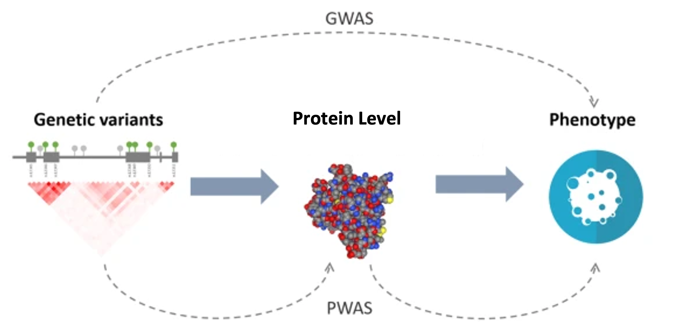
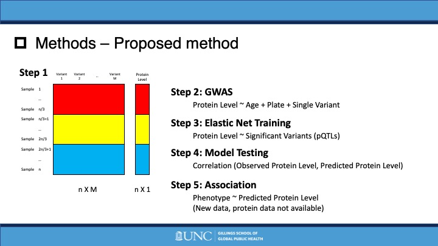

# WHIPWAS
 Repository for "Women’s Health Initiative Proteome‑Wide Association Study"

- Analyzed 552 protein levels of 1,002 individuals from Women’s Health Initiative data to identify protein quantitative trait loci (pQTL) using EPACTS
- Built protein level prediction model using CV Elastic Net and investigated cardiovascular diseases related proteins based on predicted levels in R

## PWAS (Proteome-Wide Association Study)
- New method for detecting gene-phenotype associations mediated by protein abundance level.
- PWAS aggregates the signal of variants jointly affecting a protein-coding gene and assesses their overall impact on the protein abundance level
- In traditional GWAS, we directly associate genetic variants with phenotype, and then find markers with statistical significance.
- In PWAS, there is an intermediate step, we predict protein level based on genetic variants, and then associate this level with phenotypes.
- A comparison with GWAS and other existing methods proves its capacity to recover causal protein-coding genes and highlight new associations.
- Analogous to TWAS, using protein data instead of transcriptomic data.

## Women’s Health Initiative (WHI) Proteomic Data
- Subjects: 1133 women aged between 65-95 years old (multiple self reported race/ethnicities) 
- Genotype: TOPMed Whole Genome Sequencing (Freeze 9b, Phase 2, sequencing center: BROAD)
- Protein: 552 protein level data
- Samples were included only if they had complete data for all covariates and protein data. 
- In total, 1002 samples were included in the analysis. 

Original figure from *Brandes, N., Linial, N. & Linial, M. PWAS: proteome-wide association study—linking genes and phenotypes by functional variation in proteins. Genome Biol 21, 173 (2020)*

## Proposed method
1. Divide samples by GWAS (1/3), model training (1/3), model testing (1/3)
2. Perform proteomic GWAS and select nominally significant variants to be used in model training 

$$\text{Protein Level} \sim \text{Covariates + Single genetic variant (SNP) }$$

3. Perform EN model training on nominally significant variants obtained from previous step on training samples

$$\text{Protein Level} \sim \text{Significant Variants (pQTLs)}$$

4. Perform model evaluation of previously trained model on testing samples
5. Perform association study of phenotype by predicted Protein Level

## :file_folder: Methods

### :file_folder: proposed

- :page_facing_up: main.sh
- :page_facing_up: pwas_training.R
- :page_facing_up: pwas_testing.R

> #### :file_folder: Code
> - :page_facing_up: Estimand_Cor.R: Causal estimands approximation
> - :page_facing_up: Estimator_Cor.R: Proposed esimators computation
> - :page_facing_up: Helpfunc_Cor.R: R functions for estimand and estimator computation
> - :page_facing_up: ReadResult_Cor.R: Read and summarize simulation result
> 
> #### :file_folder: Data_parallel
> - Simulated data from parallel computing
> 
> #### :file_folder: Result_parallel
> - Simulation result for Scenario 1

### :file_folder: scenario_mis
Simulation for mis-specified nuisance functions scenario

> #### :file_folder: Code
> - :page_facing_up: Estimand_Mis.R: Causal estimands approximation
> - :page_facing_up: Estimator_Mis.R: Proposed esimators computation
> - :page_facing_up: Helpfunc_Mis.R: R functions for estimand and estimator computation
> - :page_facing_up: ReadResult_Mis.R: Read and summarize simulation result
> 
> #### :file_folder: Data_parallel
> - Simulated data from parallel computing
> 
> #### :file_folder: Result_parallel
> - Simulation result for Scenario 2

### :page_facing_up: siumulation.xlsx
Simulation results for both Scenarios organized

## :file_folder: Results

### Senegal DHS data [(ANSD and ICF, 2020)](https://www.dhsprogram.com/pubs/pdf/FR368/FR368.pdf)
- Sociodemographic, enviromental, and health-related survey on household members 
- Used to assess the effect of WASH facilities on diarrhea incidence among children, allowing for interference within census blocks
- Download the data from [https://dhsprogram.com/data/available-datasets.cfm](https://dhsprogram.com/data/available-datasets.cfm) 
(requires data request submission) and place the datasets in "Data/DHS/" by following procedure:
  - Senegal: Continuous DHS, 2015 -> (download) SNKR7HDT.ZIP -> (uncompress) SNKR7HFL.DTA -> (rename) senegal15.DTA
  - Senegal: Continuous DHS, 2016 -> (download) SNKR7IDT.ZIP -> (uncompress) SNKR7IFL.DTA -> (rename) senegal16.DTA
  - Senegal: Continuous DHS, 2017 -> (download) SNKR7ZDT.ZIP -> (uncompress) SNKR7ZFL.DTA -> (rename) senegal17.DTA
  - Senegal: Continuous DHS, 2018 -> (download) SNKR81DT.ZIP -> (uncompress) SNKR81FL.DTA -> (rename) senegal18.DTA
  - Senegal: Continuous DHS, 2019 -> (download) SNKR8BDT.ZIP -> (uncompress) SNKR8BFL.DTA -> (rename) senegal19.DTA

## Result

- Household WASH facilities protect children from diarrhea, and the protective effects increase when neighboring households also have WASH facilities. 
- Childrenin WASH households can gain additional protective effect as more neighboring households are equipped with WASH facilities, which is not true for children from households without WASH facilities. 
- Therefore, it is important to install as many WASH facilities as possible
to prevent diarrhea among children.
