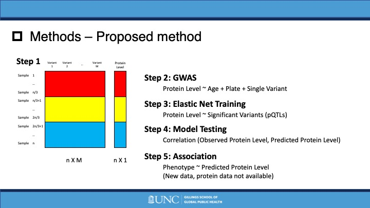
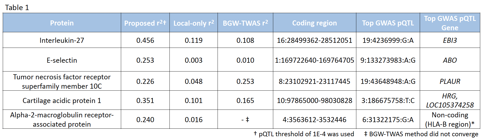
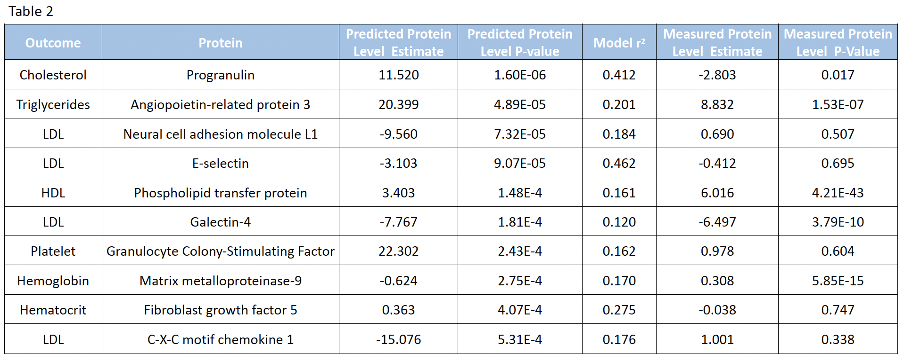

# WHIPWAS
 Repository for "Women’s Health Initiative Proteome‑Wide Association Study"

- Analyzed 552 protein levels of 1,002 individuals from Women’s Health Initiative data to identify protein quantitative trait loci (pQTL) using EPACTS
- Built protein level prediction model using CV Elastic Net and investigated cardiovascular diseases related proteins based on predicted levels in R

## PWAS (Proteome-Wide Association Study)
- New method for detecting gene-phenotype associations mediated by protein abundance level.
- PWAS aggregates the signal of variants jointly affecting a protein-coding gene and assesses their overall impact on the protein abundance level
- In traditional GWAS, we directly associate genetic variants with phenotype, and then find markers with statistical significance.
- In PWAS, there is an intermediate step, we predict protein level based on genetic variants, and then associate this level with phenotypes.
- A comparison with GWAS and other existing methods proves its capacity to recover causal protein-coding genes and highlight new associations.
- Analogous to TWAS, using protein data instead of transcriptomic data.

## Women’s Health Initiative (WHI) Proteomic Data
- Subjects: 1133 women aged between 65-95 years old (multiple self reported race/ethnicities) 
- Genotype: TOPMed Whole Genome Sequencing (Freeze 9b, Phase 2, sequencing center: BROAD)
- Protein: 552 protein level data
- Samples were included only if they had complete data for all covariates and protein data. 
- In total, 1002 samples were included in the analysis. 

Original figure from *Brandes, N., Linial, N. & Linial, M. PWAS: proteome-wide association study—linking genes and phenotypes by functional variation in proteins. Genome Biol 21, 173 (2020)*

## Proposed method
1. Divide samples by GWAS (1/3), model training (1/3), model testing (1/3)
2. Perform proteomic GWAS and select nominally significant variants to be used in model training using EPACTS

$$\text{Protein Level} \sim \text{Covariates + Single genetic variant (SNP) }$$

3. Perform EN model training on nominally significant variants obtained from previous step on training samples

$$\text{Protein Level} \sim \text{Significant Variants (pQTLs)}$$

4. Perform model evaluation of previously trained model on testing samples
5. Perform association study of phenotype by predicted Protein Level

## :file_folder: Methods

### :file_folder: proposed

- :page_facing_up: main.sh: Main bash script file to perform proposed protein prediction model training and testing
- :page_facing_up: pwas_training.R: R file to train CV Elastic Net model
- :page_facing_up: pwas_testing.R: R file to test prediction model

### :file_folder: cisonly

Build protein prediction model with cis variants only (analogous to TWAS, no Step in the proposed method)

- :page_facing_up: main.sh: Main bash script file to perform protein prediction model training and testing with cis variants only
- :page_facing_up: pwas_training.R: R file to train CV Elastic Net model
- :page_facing_up: pwas_testing.R: R file to test prediction model

### :file_folder: BGW-TWAS (Directory not included in this repo. Refer to [here](https://github.com/yanglab-emory/BGW-TWAS))

Build protein prediction model using BGW-TWAS method (Bayesian variable selection of Cis & Trans variants)

## :file_folder: Results

- :page_facing_up: scatterplots.pdf: Comparison of testing accuracies between prediction methods
- :page_facing_up: venndiagram.pdf: Number of sucessfully trained prediction models by methods
- :page_facing_up: violinplots.pdf: Violin plots of testing accuracies by methods

- For certain proteins, the proposed methods provide a better prediction result compared to TWAS-like methods

- Particular diseases are related with certain protein levels, both for predicted by the proposed methods and measured from WHI participants
